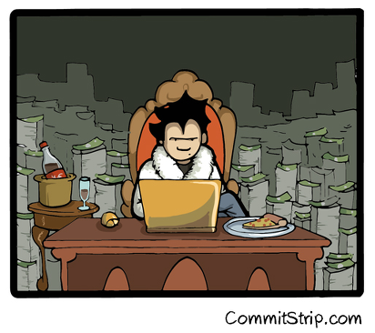

# Hands-on n.2

## Your mission … again !!
Run *flask by example* on you laptop, thanks to docker-compose.

## Detail of the mission

- Clone the hands-on branch :  ``git clone -b hands-on git@github.com:vdemeester/talk-docker-from-night-to-daylight.git``

- Base images to use
    - postgres (official)
    - redis (official)
    - backend (based on python)
    - frontend (based on python, will be almost the same image as backend ^_^'')

## Solution ?

