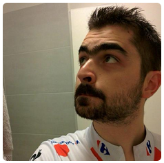
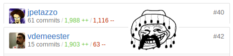

# 🐳 Docker   From Night to Daylight

<!-- .slide: class="page-title" -->

## Who am I ? Why am I talking ?

<figure style="display: block; float: left; margin: 30px 0; width: 40%">
     <figcaption><strong>Vincent Demeester</strong></figcaption>
</figure>
<figure style="display: block; float: left; margin: 30px 0; width: 60%">
     <figcaption>Small Docker contributor Docker certified trainer 🐳</figcaption>
</figure>

<!-- .element: style="display: block; float:left; margin:30px 0; width: 80%;" -->
- I'm a developer, devops, craftman — <em>I 💓 & work @Zenika</em> 
- I 💓 GNU/Linux, Docker & GNU/Emacs 
- I 💓 Free-software ! 
- I 💓 Java, Go, Python and much more 
- And I 💓 unicode, 🚴 & 🚶

<!-- .element: style="display: block; float:left; margin:120px 0; width: 20%;" -->
🐸 

## Agenda

<!-- .slide: id="master-toc" class="toc" -->

- [What is Docker ?](#/1) 
- [Docker concepts](#/2)
- <em>[Hands-on 1](#/3)</em>
- [Simple use-cases](#/4)
- [Multi-container, #dev stack](#/5)
- <em>[Hands-on 2](#/6)</em>
- <strong>[Bonus : Machine, Swarm & fun](#/7)</strong>

  
<strong>http://hokkaido.local/</strong> or <strong>http://{insert-my-ip-here}/</strong>  to get all you need setup your environment.

