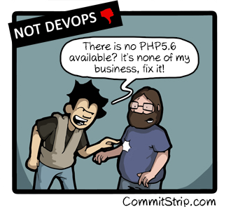
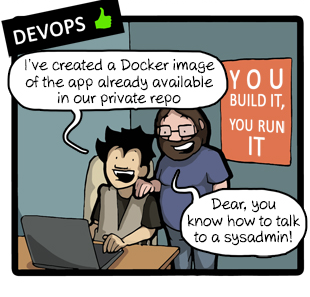
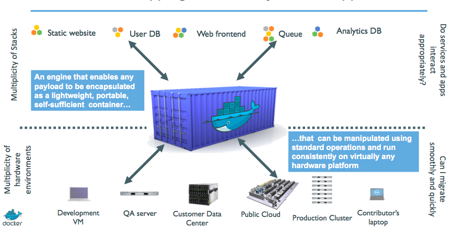
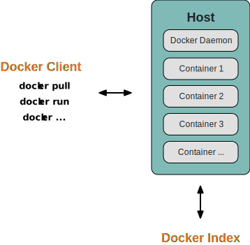
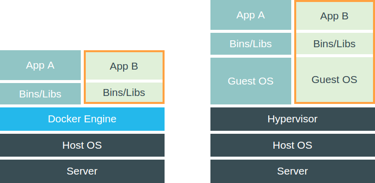

# What is docker ?

## Docker timeline

<ul class="fragment">
<li>**march 2013 :** dotCloud open-source the docker engine</li>
<li>**october 2013 :** DotCloud becomes Docker Inc.</li>
<li>[…]</li>
<li>**october 2014:** Partnership with Microsoft</li>
<li>**june 2015:** Working on Windows & FreeBSD port, new network stack (1.7.0)</li>
</ul>

<ul class="fragment">
<li>150+ Docker Meetup dans 50 pays</li>
<li>22,000+ Github stars</li>
<li>100M+ Docker Engine downloads</li>
<li>960+ contributors</li>
<li>A release every 2 months</li>
</ul>

<!-- .element: style="display: block; float:right; margin:120px 0; width: 20%;" -->
🐳 

## So what …

 

## Quotes

 
> "Docker is an open platform for developers and sysadmins to build, ship, and run distributed applications."

*docker.com*
&nbsp;&nbsp;&nbsp;&nbsp;&nbsp;
&nbsp;&nbsp;&nbsp;&nbsp;&nbsp;
&nbsp;&nbsp;&nbsp;&nbsp;&nbsp;
&nbsp;

 
 
> "Docker is an open-source project that automates the deployment of applications inside software containers"

*wikipedia.org*
&nbsp;&nbsp;&nbsp;&nbsp;&nbsp;
&nbsp;&nbsp;&nbsp;&nbsp;&nbsp;
&nbsp;&nbsp;&nbsp;&nbsp;&nbsp;
&nbsp;

## From history …

## … to the future

## Architecture: Standing on the shoulders of giants

> 🐳 It's almost like **chroot on steroids**

## Architecture: Client/Server

## Docker vs Virtual Machine

 
Containers are **NOT** VMs !!  Repeat after me : <em>Containers are <u>NOT</u> VMs</em>.

