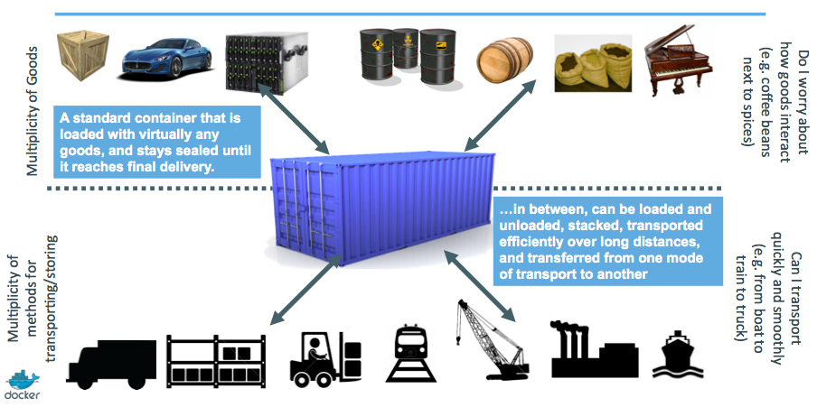

# What is docker ?

## Docker timeline

<ul class="fragment">
<li>**mars 2013 :** dotCloud open-source the docker engine</li>
<li>**aout 2013 :** eBay, Uber, Cloudfare use Docker</li>
<li>**octobre 2013 :** DotCloud becomes Docker Inc.</li>
<li>[…]</li>
<li>**octobre 2014:** Partnership with Microsoft</li>
<li>**2015:** Working on Windows & FreeBSD port</li>
</ul>
<ul class="fragment">

<li>150+ Docker Meetup dans 50 pays</li>
<li>22,000+ Github stars</li>
<li>100M+ Docker Engine downloads</li>
<li>960+ contributors</li>
<li>A release every 2 months</li>
</ul>

## So what …

 

## Quotes

 
> "Docker is an open platform for developers and sysadmins to build, ship, and run distributed applications."

*docker.com*
&nbsp;&nbsp;&nbsp;&nbsp;&nbsp;
&nbsp;&nbsp;&nbsp;&nbsp;&nbsp;
&nbsp;&nbsp;&nbsp;&nbsp;&nbsp;
&nbsp;

 
 
> "Docker is an open-source project that automates the deployment of applications inside software containers"

*wikipedia.org*
&nbsp;&nbsp;&nbsp;&nbsp;&nbsp;
&nbsp;&nbsp;&nbsp;&nbsp;&nbsp;
&nbsp;&nbsp;&nbsp;&nbsp;&nbsp;
&nbsp;

## From history …

## … to the future

## Architecture: Standing on the shoulders of giants

> 🐳 It's almost like **chroot on steroids**

## Architecture: Client / Serveur

## Docker vs Virtual Machine

 
Containers are **NOT** VMs

