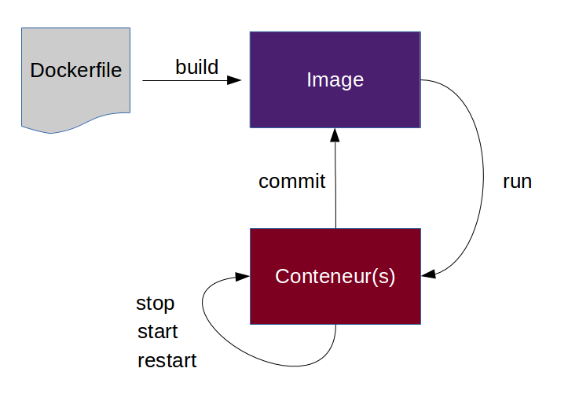
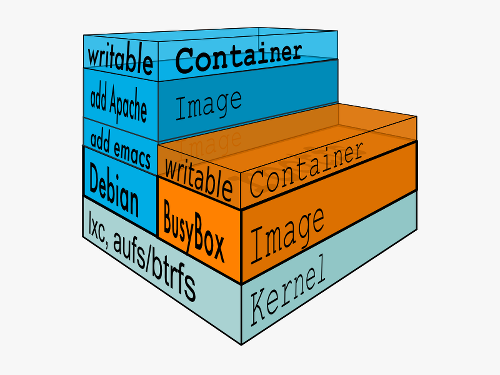

# Docker concepts


## Main concepts

- We're going to talk about
    - Containers
    - Images
    - Registry


*Not gonna lie, it's going to be a lot to process*


## Lifecycle




## Containers : Run it

- Run your first
```bash
$ docker run -ti ubuntu /bin/bash
```

- Create and start
```bash
$ docker create jpettazo/clock
$ docker start -d 0c1
```

- Is it running ?
```bash
$ docker ps
```

- Look at it
```bash
$ docker logs -f 0c1
```


## Containers : Stop it

- Stop it
```bash
$ docker stop 0c1
# or kill it
$ docker kill 0c1
```

- Is it still running ?
```bash
$ docker ps
# […]
# guess not :)
```

- But wait, is it gone ?
```bash
$ docker ps -a
# […]
# guess not :)
```


## Containers : More fun o/

- Remove a container with ``rm``
- Inspect the container :
  - ``docker inspect`` for a raw json *thingy*…
  - … but it supports formatting <br/>``docker inspect -format '{{ .NetworkSettings.IPAddress }}' 0c1``
  - see what ports it exposes : ``docker port 0c1``
  - ``docker stats`` and ``docker top`` to more stats
- Execute something in the container (*debug*) : <br/>``docker exec -ti 0c1 top``


## Containers to images

Now we played a bit with containers, let's convert it to an images

- Show what changed inside the container : ``docker diff 0c1``

- Ok ? Commit the change then :
  - the hard way
    - ``docker commit 0c1 # -> 9dd``
    - ``docker tag 9dd myimage``
  - the simple way ``docker commit 0c1 myimage``

- We can tag it (like ``git``)<br/>
``docker tag myimage myimage:v1``

- Verify it is somewhere : ``docker images``

- That was a fake so… let's remove it ``docker rmi myimage``


## What are images ?



- **Images** : read-only template filesystem, made of multiple layers<br/>object-oriented metaphor : *class* & layers like *inheritance*
- **Containers** : created from images with a read/write (cow) layer<br/>object-oriented metaphor : *instance*


## More about images

- It can be exported and imported (with layers)<br/>``docker save busybox -o busybox.tar.gz``<br/>``docker load -i busybox.tar.gz``
- It can be imported from a tar file, to a *single* layer<br/>``cat mycontainer.tgz | sudo docker import -``
- Wait.. a ``mycontainer.tgz``, is it a container export ?<br/>``docker export 0c1 > mycontainer.tgz``

- Publish it, Search it and Get it !<br/>
``docker push myimage``<br/>
``docker search myimage``<br/>
``docker pull myimage``


## There must be a better way …

… to build an image !! And it's called a ``Dockerfile``


```bash
FROM debian:jessie                   # Base image (debian)
MAINTAINER John Doe <john@doe.com>

RUN apt-get -y update                # Run a command
RUN ["apt-get", "-y", "update"]      # … different notation
RUN apt-get -y install git \ 
    openjdk-7-jre                    # … multiple lines support

ADD http://bit.ly/1HyjEeA /whale.gif # Add with magic (URLs, extract)
COPY target/foobar.jar /             # Copy files/folders/…

EXPOSE 8080                          # Expose a port (meta-data)
VOLUME ["/data"]                     # Declare a volume (more later…)

ENV IN_DOCKER=y                      # Set a environment variable
WORKDIR /                            # Set the $PWD of the process
CMD ["java", "-jar", "/foobar.jar"]  # The default command to run

ENTRYPOINT ["/bin/sh", "-c"]         # Some magic…
ONBUILD RUN touch /tmp/onbuild       # Some even more dark magic…
```


## Let's build the image

```bash
$ docker build -t test .
Step 0 : FROM debian:jessie
 ---> aaabd2b41e22
Step 1 : MAINTAINER John Doe <john@doe.com>
 ---> Running in fecfccae398b
 ---> 3d290dc10132
Removing intermediate container fecfccae398b
Step 2 : RUN apt-get -y update
 ---> Running in d72fb9cfda61
# […]
Step 5 : ADD http://bit.ly/1HyjEeA /whale.gif
Downloading [======================>]  1.02 MB/1.02 MB
# […]
Step 11 : CMD java -jar /foobar.jar
 ---> Running in 4239619930e2
 ---> 8ba1ccb146c9
Removing intermediate container 4239619930e2
# […]
Successfully built 8ba1ccb146c9
$ docker run -rm -i test1 # it runs !
```

* Each step will become a layer, even for meta-datas
* It's is reproductible, let's feed your continuous integration system !


## Let's talk about Volumes

Volumes act as passthroughs to the host filesystems, *bypassing the layers*, meaning :

- I/O performances are the same as the host
- ``docker commit`` won't put the content of the volume in the image
- ``RUN`` in a ``VOLUME`` won't be put in the image as well

<br/>
It can be used for :

- I/O performances

- Sharing data between containers ``--volume-from``

- Sharing data from host to containers

- Sharing a single file (like a socket, …) from host to containers<br/>
*dockerception is near >_<*


