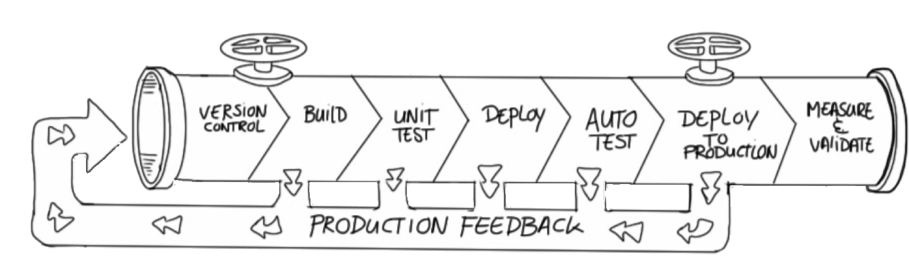

# "Simple" Use cases

## Isolate build

- Language stack & build images
    - Build tools inside images
- "Separation of concern"
    - Jenkins & slaves just have to have Docker install
    - Dev & Continuous integration are based on the same image for the *build*
- Developers have a better "hand" on the *build*

Notes :
- build container
- Language stack
- Jenkins/CI

## Development environment setup

- External service dependencies externalized and isolated on dev' machines
    - No need to install and configure them on the machine, just ``pull`` it
- Centralize specific configurations and distribute them across developers
    - Same for all
    - Provided by ops, real close to production (if no docker in production)
- Easy to switch stack (from a project to another)
    - ``docker stop``, ``docker run``
- Again, continuous integration is a blast

Notes :
- External services (ActiveMQ, ..), pas besoin de les installer sur le
  poste de dev.

## Tests in a different environment

- What if I wanna.. :
    - .. try if my app. runs on the latest Ruby version
        - ``docker […] run ruby:2.1.5 […]``
    - .. validate that my app. is building under Java 6
    - .. validate that my app. is still compatible with a specific MySQL version (5.6)
    - .. validate that my app. is *scalable*, by running a bunch of them
    - .. try out things like gitlab, kanboard, a node.js application ``xD``

- And all of this without ``ruby``, ``java``, ``node``, ``mysql``, ``insert your stack here`` installed on your laptop

## Continuous delivery

- Build the image first (CI), use the **same** image for the rest of the pipeline *Build once, run everywhere*
- Easy, fast and simple to create instances
- Encourages collaboration between Dev and Ops

Notes :
- Explain the :
  - checkout, build, dev, build, dev, …
  - commit, ci build, cd pipelines tests …
  - deploy (blue/green deployment)

## For the fun : no more package manager

- Link to @jfrazelle talk
- You want chrome ? there an image for that : ``docker run jessfraz/chrome``
- You don't want Chrome to eat all your memory ? 
``docker run -m 512m \`` 
``       # […]`` 
``       jessfraz/chrome``
- You want spotify ? there an image for that :
- You want to run IntelliJ ? there an image for that :
   
<em>I could go on, but guess you got it ;-)</em>
