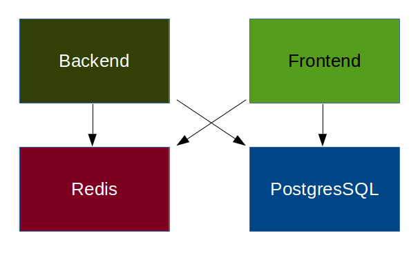

# Multi containers


## What ? Why ?

- A container, a process
- An application is most of the time, multiple process, external dependencies (database, …)

- Example : [Flask by Example](https://realpython.com/blog/python/flask-by-example-part-1-project-setup/)
    - PostgreSQL
    - Redis
    - Backend
    - Frontend

Notes :
- Besoin réel, plusieurs conteneurs, ...


## How ?



Docker provides the links (``--links``) for that

Notes :
- Schema avec les différents composants dans des docker (mode dev,
  mode prod)


## Links (1/2)

Link containers with *bind* ports on the host<br/><br/>

Syntax : ``--link <name or id>:<alias>``


```bash
$ docker run -d --name mypostgres postgres
$ docker run -d -P --name web --link mypostgres:db myapp
```

- Defines environment variables in the container (``web``)
- Adds an entry to the ``/etc/hosts`` that point to the container
- Nothing magic, your app has to handle either the environment variable or point to the *aliased* host

Notes :
- Port ne sont pas binder/exposés
- Le conteneur ``db`` n'est pas bindé sur le host


## Links (2/2)

- Environment variables
    - ``DB_NAME`` ➜ /web/db
    - ``DB_PORT`` ➜ tcp://172.17.0.5:5432
    - ``DB_PORT_5432_TCP`` ➜ tcp://172.17.0.5.5432
    - ``DB_PORT_5432_TCP_PROTO`` ➜ tcp
    - ``DB_PORT_5432_TCP_PORT`` ➜ 5432
    - ``DB_PORT_5432_TCP_ADDR`` ➜ 172.17.0.5

Notes :
- Demo avec un conteneur qui ``EXPOSE`` plusieurs port et un link


## Let's do it (manually)

- Redis : ``docker run -d --name redis redis``
- PostgreSQL : ``docker run -d --name postgres postgres``
- Backend : ``docker run -d --link redis:redis --link postgres:db --name backend backend``
- Frontend :``docker run -d --link redis:redis --link postgres:db --name frontend frontend``


It sure could be easier, right ? with a *one-line command* !

Notes :
- exemple + interactif sur mise en place à la main
- L'ordre est important, 4 commandes c'est pas la mort mais..


## Tools

- *Docker-compose* a.k.a **fig** (python, conf. yaml)
    - Official support from Docker Inc.
<br /><br />
- Crane (Go, conf. json/yaml)
- Maestro (Python, conf. yaml)
- Decking (Node, conf. json)

- cloud ready : kubernetes, flocker, ...

Notes :
- à la main c'est bien mais.. je suis fainéant.. :D
- fig par orchard, racheté par Docker inc.
- fig, decking, flocker, ...


## docker-compose.yml

```
web:
    build: .
    command: python app.py
    enviroment:
    - LANG=C
    links:
    - db
    ports:
    - "8000:8000"
mycontainer:
    build: ./path
    expose:
    - "3000"
    volumes:
    - ~/configs:/etc/configs/:ro
    net: "none"
    user: me
db:
    image: postgres
    env_file: .env
```

Notes :
- introduction, feature, démo


## docker-compose commands

- ``up`` : start one or all services (containers)
- ``build`` : build the images
- ``start``, ``stop``, ``kill`` : well… obvious :)
- ``run`` : start a service in a new container with a specific command
- ``logs``, ``port``, ``ps`` : get information about your services
- ``scale`` : define the number of service (container) to launch
```bash
$ docker-compose scale web=2 worker=3
```

Notes :
- live demo avec scale également


## Let's (re)do it


