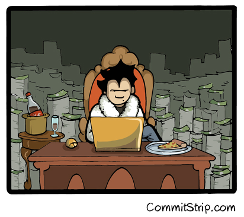

# Hands-on n.2

## Your mission … again !!
Faire tourner *flask by example* grâce à docker-compose.

## À votre disposition

- Les différentes sources se trouve ici : http://github.com/zenika/..
    - ``frontend`` & ``backend`` : source de notre application
    - ``docker-compose.yml`` : fichier à compléter
- Images sur lesquelles se baser
    - postgres (officielle)
    - redis (officielle)
    - backend (basé sur python)
    - frontend (basé sur python, même container que backend ^_^'')

## Solution ?

