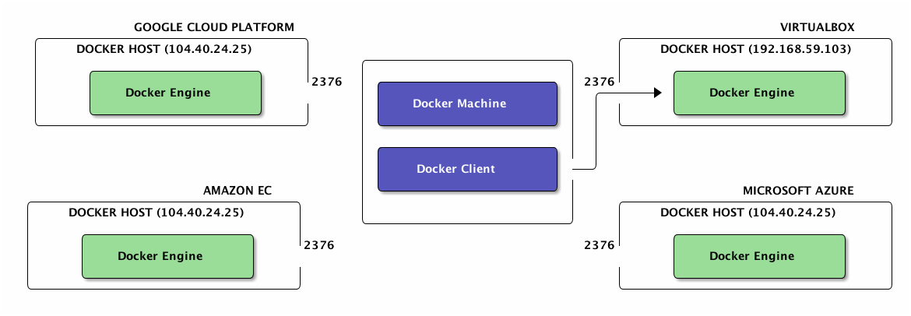

# <span style="font-size: 2em;"><span style="font-weight: bold;">Bonus</span> 🐳</span> <br/> Deployement, Clusters


## Docker Machine

Outil pour créer et gérer des Docker hosts. Distants ou pas.


Providers déjà supportés : <br/>
*Amazon EC2*, *Microsoft Azure*, *Microsoft Hyper-V*, *DigitalOcean*, *Google Compute Engine*, *OpenStack*, *Rackspace*, *SoftLayer*, *VirtualBox*, *VMware Fusion*, *VMware vCloud Air*, *VMware vSphere*

Notes :
Docker machine est un outils qui permet de creer et administrer des VM ou l'on pourra deployer des conteneurs. Ces VM peuvent être en local (VirtualBox et VMWare Fusion) ou distantes (Amazon EC2, Azure, GCE etc...). La puissance du IaaS avec la convention et le standard des conteneurs Docker. 
Les fonctionnalités de Docker Machine ressemblent beaucoup à celles de Vagrant. 
Le 26 Février 2015 a été releasée la version beta de Docker Machine.
Nous allons nous en servir pour deployer des containers distants.


## Déploiement dans le cloud - Demo
<br/>
*GCE*, *Amazon EC2*, *Microsoft Azure*, *Virtualbox*<br/>

1. Configuration du service (operations manuelles)
2. Creation de la machine
```bash
docker-machine create -d <driver> [DRIVER-SPECIFIC-OPTIONS] <machine-name>
```
3. Activer le flux TCP en entrée (opération manuelle)
4. Setup du client
```bash
$(docker-machine env)
```
5. Utilisation du client Docker
```bash
docker run -d zenika/nodejs-sample-app
```


## Docker Swarm (1/2)

*Clustering made-in Docker*


Notes :
- Aggrège des hôtes Docker
- Le manager parle Docker
- Support de base plusieurs système de découverte (discovery)
    - etcd, consul, zookeeper, built-in, static


## Docker swarm (2/2)

- Démarre intelligement les conténeurs (scheduler)
    - ressources disponible vs demandée
    - mécanisme de filtre (contrainte, affinity, ..)<br/>
    ``-e constraint:storage==ssd``<br/>
    ``-e affinity:container==front``

- Mise en place avec discovery statique
    - Manager :
    ``docker run --name swarm-manager -d -P swarm manage nodes://<node_ip1:2375>,<node_ip2:2375>,<node_ip3:2375>``


## Multi hôte (version swarm)

- Mettre en place swarm (manager & agent)
- Faire pointer le client vers swarm (``DOCKER_HOST``, ..)
- ``$ docker run -d --name postgres postgres``
<br/>``$ docker run -d -e affinity:container==postgres --name redis redis``
<br/>``$ docker run -d --link redis:redis --link postgres:db --name backend backend``


Notes :
- docker-compose
    - build KO
    - timeout rapidement => mettre à dispo les images
- docker run -d --name backend \
  -e DB_PORT_5432_TCP_ADDR=${IP1} -e DB_PORT_5432_TCP_PORT=${PORT1} \
  -e REDIS_PORT_6379_TCP_ADDR=${IP2} -e -REDIS_PORT_6379_TCP_PORT=${PORT2} \
  backend


## For the real fun…

… We are going to deploy a change we made on a swarm cluster, with a bare git commit :D
