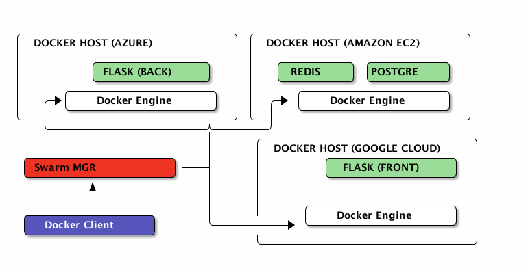

# <span style="font-size: 2em;"><span style="font-weight: bold;">Bonus</span> 🐳</span> <br/> Machine, Swarm & fun


## Docker Machine

Tool to create and provision Docker hosts ; on different providers (local, cloud, …)


Incomplete list of supported providers : <br/>
*Amazon EC2*, *Microsoft Azure*, *Microsoft Hyper-V*, *DigitalOcean*, *Google Compute Engine*, *OpenStack*, *Rackspace*, *SoftLayer*, *VirtualBox*, *VMware Fusion*, *VMware vCloud Air*, *VMware vSphere*

Notes :
Docker machine est un outils qui permet de creer et administrer des VM ou l'on pourra deployer des conteneurs. Ces VM peuvent être en local (VirtualBox et VMWare Fusion) ou distantes (Amazon EC2, Azure, GCE etc...). La puissance du IaaS avec la convention et le standard des conteneurs Docker. 
Les fonctionnalités de Docker Machine ressemblent beaucoup à celles de Vagrant. 
Le 26 Février 2015 a été releasée la version beta de Docker Machine.
Nous allons nous en servir pour deployer des containers distants.


## Deploy in the Cloud
<br/>
*GCE*, *Amazon EC2*, *Microsoft Azure*, *Virtualbox*<br/>

1. Configure the service (manual)
2. Create the *machine*
```bash
docker-machine create -d <driver> [DRIVER-SPECIFIC-OPTIONS] <machine-name>
```
3. (optional) Activate network stuff (open ports & co)
4. Client setup
```bash
$(docker-machine env)
```
5. Use Docker, as usual
```bash
docker run -d zenika/nodejs-sample-app
```


## Docker Swarm (1/2)

*Clustering made-in Docker*



Notes :
- Aggrège des hôtes Docker
- Le manager parle Docker
- Support de base plusieurs système de découverte (discovery)
    - etcd, consul, zookeeper, built-in, static


## Docker swarm (2/2)

- Schedule containers according to different algorithm
  - Available resources vs needed
  - By constraint, affinity, filtering<br/>
    ``-e constraint:storage==ssd``<br/>
    ``-e affinity:container==front``

- Use discovery services
    - supports ``etcd``, ``consul``, …
    - the simple build-in one (for demo only):
    ``docker run --name swarm-manager -d -P swarm manage nodes://<node_ip1:2375>,<node_ip2:2375>,<node_ip3:2375>``


## Play with a swarm cluster

- Setup swarm (manager & agents)
- Setup docker client to talk to the swarm manager (``DOCKER_HOST``, ..)
- Use Docker, as usual :
<br/>``$ docker run -d --name postgres postgres``
<br/>``$ docker run -d -e affinity:container==postgres --name redis redis``
<br/>``$ docker run -d --link redis:redis --link postgres:db --name backend backend``
<br/>``$ docker run -d --name frontend frontend``


Notes :
- docker-compose
    - build KO
    - timeout rapidement => mettre à dispo les images
- docker run -d --name backend \
  -e DB_PORT_5432_TCP_ADDR=${IP1} -e DB_PORT_5432_TCP_PORT=${PORT1} \
  -e REDIS_PORT_6379_TCP_ADDR=${IP2} -e -REDIS_PORT_6379_TCP_PORT=${PORT2} \
  backend


